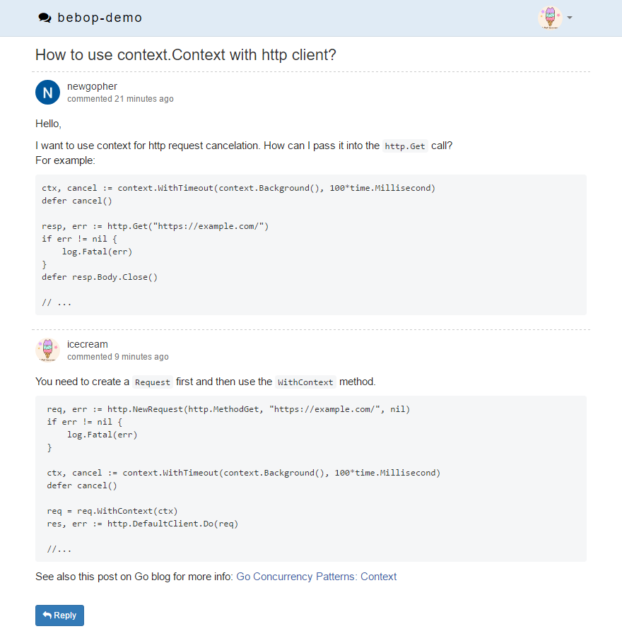

# Bebop

Bebop is a simple discussion board / forum web application.

## Features

- REST API backend written in Go
- Vue.js-based frontend
- Two databases are supported: 
  - PostgreSQL
  - MySQL
- Three file-storage backends are supported to store user-uploaded files (e.g. avatars):
  - Local filesystem
  - Google Cloud Storage
  - Amazon S3 (untested)
- Social login (OAuth 2.0) via three providers:
  - Google
  - Facebook
  - Github
- Json Web Tokens (JWT) are used for user authentication in the API
- Single binary deploy. All the static assets (frontend JavaScript & CSS files) are embedded into the binary
- Markdown comments
- Avatar upload, including animated GIFs. Auto-generated letter-avatars on user creation

## Getting Started

  * Create a new empty database (MySQL оr PostgreSQL) that will be used as a data store and a database user with all priveleges granted on this database.

  * Obtain OAuth 2.0 credentials (client_id and secret) from at least one of the providers (Google, Facebook, Github) so users can log into the web application. The OAuth callback url will be `<base_url>/oauth/end/<provider>`. The `<base_url>` is where the bebop web app will be mounted on your site and the `<provider>` is the lowercase provider name. For example, if base_url is `https://my.website.com/forum/`, then the oauth callback url for google will be `https://my.website.com/forum/oauth/end/google`.
 
  * Download and compile the bebop binary:
    ```
    $ go get -u github.com/disintegration/bebop/cmd/bebop
    ```
 
  * Inside an empty directory run:
    ```
    $ bebop init
    ```
    This will generate an initial configuration file "bebop.conf" inside the current dir.
    Edit the configuration file to set the server listen address, the base url, the database and file storage parameters, OAuth credentials, etc.
 
  * Run the following command to start the bebop web server.
    ```
    $ bebop start
    ```
    
  * Sign in into your web application using one of the social login providers.
    Then run the following command to grant admin privileges to your user.

    ```
    $ bebop add-admin <your-username>
    ```

## Screenshots

### Topics


### Comments

